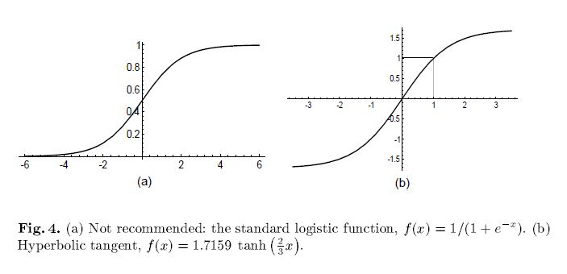

Back prop
=========

-	저자 : Yann LeCun, Leon Bottou, Genevierve B. Orr, Klaus-Robert-Muller
-	출판년도 : 1988
-	Introduction
	-	(optional) 논문리뷰 하는 법
	-	선대 사전지식(hessian, jacobian etc)
	-	전반적인 내용이 어떻게 진행될지 결론 설명

ch-1 introduction
-----------------

### ss-1-1 논문 리뷰법

#### sss-1-1 엄태웅(Feat. 연예인)

-	구조
	1.	`Abstract` : 문제제기
	2.	`Introduction` : 연구의 기원
	3.	`Related works` : 기존의 접근법\`
	4.	`Method` : 새로운 접근법
	5.	`Experiment` : 실험
	6.	`Discussion` : 검증 및 한계
	7.	`Colclusion` : 요약
-	순서
	-	Abstract > Conclusion > Introduction > ...

#### sss-1-2 태희님(Feat. 갓)

-	논문 검색 : 구글 검색 및 arxiv
-	논문 관리 : mendeley
	-	소셜 네트워크 기반의 서지관리 소프트웨어
-	좋은 논문 : CS231n or ICLR, ACL, EMNLP...의 학회에서 accepted 붙은 논문
-	논문 리뷰
	-	`어떤 문제를 풀려고 하는지`
		-	논문의 문제 의식 in `introduction` or `abstract`
	-	`지난 연구의 흐름`
		-	과거에는 어떤 방식을 취했었고 리뷰 논문 과의 차이 in `introduction`
	-	`Task의 소개(Option)`
		-	보통 제목에 많이 나와 있음
		-	architecture들의 용도와 input과 output
	-	`Model, method`
		-	Input - Output사이의 과정 + 의미
	-	`논문에 대한 해석`

### ss-1-2 선형대수 사전 지식

#### sss-1-2-1 Gradient


-	각 변수로의 일차 편미분 값으로 구성되는 벡터 - f의 값이 가장 가파르게 증가하는 방향 - 벡터의 크기 : 가파른 정도

#### sss-1-2-2 Jacobian


-	어떤 다변수 벡터함수(vector-valued function of multiple variables)에 대한 일차 미분

#### sss-1-2-3 Hessian


-	함수의 곡률(curvature) 특성을 나타내는 행렬로 함수의 이차 미분 - 어떤 함수의 critical point에서 계산한

### ss-1-3 전반적 내용 설명

#### sss-1-3-1 Abstract

-	***연구자들의 back-prop convergence learning에 대한 분석***
-	`지난 연구의 흐름`

	-	그동안 많은 저자들이 신경망의 훈련에 대한 2차 최적화 방법들을 제안해 왔으나 대부분의 고전적 방법들은 대형 신경 네트워크에 대해 실용적이지 못했으며 몇 몇의 방법만이 제한 없이 작동해 왔습니다.
		-	➔ 그동안은 대형 신경 네트워크에 대해서는 좀 구렸어!

-	`어떤 문제를 풀려고 하는지?`

	-	실험에서 관찰된 일반적인 현상들을 설명하기 위해 back-prop들을 분석함
	-	이런 분석을 통해 back-prop의 수행 시 잘못된 행동들을 피하기 위한 방법들의 종류와 이것들이 대체 왜 작동 하는지!
		-	➔ 그니까 이런 제한이 없도록 최적화를 해 보아요!

-	how to solve

	1.	how to input
	2.	how to handle the activation function
	3.	how to handle the weight and learning rate
	4.	how to trian

### ss-1-4 Introduction

-	Backpropagation
	-	장점
		-	개념적으로 간단함
		-	효율적
		-	대부분 잘 동작함
	-	단점
		-	데이터에 의존적임
		-	여러 문제들이 섞여 명확한 근거를 찾기 힘듬
		-	하이퍼파라미터(노드&레이어의 유형과 갯수 / 학습율 / 훈련&시험 세트...etc)
	-	포인트
		-	과학(science, 이론 or 이성)보다는 예술(art, 감각)이 중요
		-	경험적이고 근본적인 이론 정립을 통해 실험자들이 더 나은 선택(Hyperparameter)을 할 수 있도록 해야 함
-	진행 순서
	1.	backpropagation, 그리고 그동안 쌓인 수 많은 경험과 기술들에 대한 설명
	2.	고전적인 2차 비선형 최적화 기술들과 이들의 한계
	3.	특정 상황에서 학습을 가속하기 위한 몇 가지 2차 방법들

### ss-1-5 Conclusion

-	앞 내용들의 요약

-	multi-layer 신경망 훈련 문제를 직면한 실무자들이 따라야 할 과정

	-	shuffle the examples
	-	center the input variable by subtracting the mean
	-	normalize the input variable to a standard deviation of 1
	-	if possible, decorrelate the input variables.
	-	pick a network with the sigmoid function shown in figure 4
	-	set the target values within the range of the sigmoid, typically +1 and -1
	-	initialize the weights to random values as prescribed by 16

-	훈련시 선호되는 방법들

	-	if the training set is large(more than a few hundred samples) and rebundant, and if the task is classification, use stochastic gradient with careful tuning, or use the stochastic diagonal Levenberg Marquardt method.

	-	if the training set is not too large, or if the task is regression, use conjugate gradient

-	개선사항

	-	multi-layer 신경망에서의 stochastic gradient decsent의 비선형 동역학은 특히 일반화에 대해 잘 이해되지 않고 있기에 더 많은 이론과 시스템적 실험 작업들을 필요로 함

ch-2 input
----------

-	ss-2-1 (本) Gradient Descent

<br><br><br>

### ss-2-1 Batch learning v.s. Stochastic learning

#### sss-2-1-1 Batch learning


-	For computing the true gradient, an entire "batch" of data must be considered.<br><br>* Advantages<br> * Conditions of convergence are well understood.<br> * Many acceleration techniques only operate in batch learning.<br> * Theoretical analysis of the weight dynamics and convergence rates are simpler.<br><br><br>

#### sss-2-1-2 Stochastic learning


-	a single example {Zt, Dt} is randomly chosen from the training set at each iteration t* An estimate of the true gradient is computed based on the error Et of that example* The size of fluctuations depend on the degree of noise of the stochastic updates<br><br>* Advantages<br> * usually much faster than batch learning. * (ex) 1000(training data size)=100(samples)x10(repeat) <br> * often results in better solutions.<br> * noise present in the updates --> weights jumping into the basin of another, possibily deeper, local minimum <br> * used for tracking changes.<br> * useful when data distribution changes gradually over time. (ex) industry<br><br>* In reality, Stochastic learning > Batch learning<br><br><br><br>

### ss-2-2 Shuffling the Examples

-	(Idea) Networks learn fast when there are unexpected samples<br> → Everytime let's choose a sample at each iteration that is the most unfamiliar to the network<br><br>
-	Q. which inputs are information rich? <br>
	-	A1. choose successive examples from different classes<br>
	-	A2. examine the error b/t the network output and the target value.<br>
	-	relatively large error → this input has not been learned by the network<br><br>
-	Advantages<br>
	-	when boosting the performance for infrequently occuring inputs<br><br>
-	Disadvantages<br>
	-	data containing outliers<br><br><br><br>

### ss-2-3 Normalizing the Inputs

-	(step1) Convergence is faster when the average of each input variable is close to zero. (ex) all positive inputs <br>
	-	If not, it will bias the updates in a particular direction → learning slow <br>
	-	applied at all layers <br><br>
-	(step2) Convergence is faster when inputs are scaled so that all have about the same covariance<br>
	-	(Except. we know that some inputs are of less significance than others)<br><br>
-	(step3) Input variables should be decorrelated if possible 

ch-3 activation function
------------------------

### ss-3-1 what is the activation function

-	nonlinear activation function give NN nonlinear capability <br><br>
-	sigmoid : standard logistic function
	-	monotone increasing
	-	asymptote finite value
	-	var(output) close to 1 <br><br>
-	symmetric sigmoids
	-	faster than standard logistic



### ss-3-2 advance

-	stimes, computationally expensive => ratio of polynomials
-	stimes, to add linear term is helpful
-	constants : **when transformed inputs**
-	(now) ReLU and further more.

### ss-3-3 problems

-	***error surface can be very flat near the origin***
	-	to add linear term stimes helpful <br><br>
-	***inputs should be normaalized to produce outputs that are on average close to zero***
	-	binary target problem
		1.	instablility : W => infinity, where Sigmoid 편미분 => 0
		2.	if input falls near a decision boundary, output should be two values
	-	set target to be within range of sigmoid rather than asymptotic value

ch-4 weight
-----------

-	***choice of weight initialization***

### ss-4-1 W ~ N(0,1)

### ss-4-2 Learning rate

-	learning rate tuning

	1.	error가 수렴하지 못하고 발산하면, learning rate를 감소시킨다.
	2.	error의 수렴 속도가 너무 느리면, learning rate를 증가시킨다. <br><br>

-	problem : SGD, online learning에 부적합

	-	weight vector가 항상 변하기 때문 <br><br>

-	solution : 각 weight에 대해 각기 다른 learning rate를 선택

	-	모든 weight가 같은 속도로 수렴되도록 만드는 게 좋다.
	-	error surface의 곡률에 따라 각 weight는 적절한 속도로 수렴하기 위해 다른 learning rate를 필요로 한다.
	-	learning rate : **lower layer > higher layer** <br><br>

-	weight를 공유하여 사용하는 NN의 경우

	-	eg) time-delay NN (TDNN), CNN
	-	해당 weight의 sqrt(\# of edge)에 비례하게 설정
		-	왜냐하면 gradient가 더 많거나 독립적인 term의 합이기 때문

ch-5 Training Method
--------------------

-	5장부터 9장까지는 Training method에 대한 설명
-	여러 방법에 대한 짧은 소개가 대부분(자세한 설명x)
-	3가지를 주로 설명할 것
-	수식은 거의 다 다른 논문에서 인용


```
-5. Gradient descent 설명
-6. Second-order method 설명
-7. 멀티레이어에서 쓰이는 헤시안 행렬 설명
-8. 다중레이어 헤시안으로 분석
-9. 다중레이어 신경망에 Second-order method 적용해보기
```

### ss-5-0 Index

-	SGD (5-2,5-3)
-	Gauss-Newton (6-4)
-	Levenberg Marquardt (7-2, 9-1)

### ss-5-1 Convergence of Gradient Descent

#### sss-5-1-1 A Little Theory

-	1차원 gradient descent
-	최적의 learning rate 찾기
-	learing rate 범위를 어떻게 봐야 하는가
-	최적의 learning rate보다 작게하면 오래걸리고 크게 하면


-	이후에 나오는 수식들은 최적화 가중치를 찾는 과정들
-	처음에는 1차원 수식 설명
-	1차원에서 optimal learning rate 찾기
-	2차원에서 가중치 찾기
-	2차원에서 optimal learning rate 찾기
-	multiple dimensions에서 optimal learning rate 찾기
-	error function으로 LMS 사용

-	오차 제곱합이 최소화 되도록 모델 파라미터 p를 정하는 방법을 최소자승법(least square method)

##### atc-5-1-1-1 1차원일 때 loss function


##### atc-5-1-1-2 최적의 Weight


#### sss-5-1-2 Examples

##### atc-5-1-2-1 Linear Network


### ss-5-2 추가

#### sss-5-2-1 SGD (Stochastic Gradient Descent)

-	확률 경사하강법
-	batch mode 대신 SGD 사용
-	(구체적인 설명이 없어서 아쉬움)


#### sss-5-2-2 Multilayer Network


#### sss-5-2-3 Input Transformations and Error Surface Transformations Revisited

1.	입력 변수에서 평균 빼기
2.	입력 변수의 분산 정규화
3.	입력 변수의 상관관계 확인
4.	각각의 가중치에 learning rate를 따로 사용해라

### ss-5-3 참고

#### sss-5-3-1 Frist-order optimization

-	Gradient descent 알고리즘의 변형 알고리즘들
-	Momentum, NAG, AdaGrad, AdaDelta, RMSProp, Adam 등

#### sss-5-3-2 Second order optimization

-	Gradient descent 알고리즘의 변형 알고리즘들
-	비싼 작업이라 잘 사용 안함
-	왜 비쌀까? Hessian matrix 라는 2차 편미분 행렬을 계산한 후 역행렬을 구하기 때문

##### atc-5-3-2-1 first와 second를 나누는 기준은 미분을 한 번 했냐 두 번했냐의 차이

-	2차 편미분이 포함된 식은 second
-	1차 편마분만 포함된 식은 first

---

### ss-5-4 Classical second order optimization methods

-	second-order optimization methods가 왜 imparctical 한지 증명하지는 않을것

#### sss-5-4-1 Newton Algorithm

-	뉴턴 알고리즘은 21번에서 23번을 빼준것

-	error function이 2차원일때 one step으로 수렴한다

##### atc-5-4-1-1 참고 사이트

-	[뉴턴법/뉴턴-랩슨법의 이해와 활용(Newton's method)](https://darkpgmr.tistory.com/58)

뉴턴 알고리즘과 gradient descent 비교

#### sss-5-4-2 Conjugate Gradient

-	켤레기울기법 또는 공역기울기법
-	수학에서 대칭인 양의 준정부호행렬(陽-準定符號行列, 영어: positive-semidefinite matrix)을 갖는 선형계의 해를 구하는 수치 알고리즘
-	헤시안 행렬을 사용하지않음 (왜?)
-	O(N) method 사용
-	bactch mode 사용


first gradient descent에서 직각을 찾음 최소화하는 gradient descent direction을 찾음 벡터에서 다시 직각이 되는 gradient를 찾음


#### sss-5-4-3 Quasi-Newton (BFGS)

-	헤시안 역행렬의 추정을 이용해 계산하는 방법
-	오직 batch learning만 사용 (mini-batch 사용안함)
-	O(N^2) 알고리즘 사용
	-	M = positive definite Matrix
	-	M = I


#### sss-5-4-4 Gauss-Newton and Levenberg Marquardt

-	Levenberg–Marquardt 방법은 가우스-뉴턴법(Gauss–Newton method)과 Gradient descent 방법이 결합된 형태로 볼 수 있다.
-	Levenberg–Marquardt를 사용하거나 이해하기 위해서는 위 두가지 방법을 알아야한다,

-	Gauss-Newton and Levenberg Marquardt는 Jacobian(자코비언) 근사를 사용한다.

-	또한 주로 batch learning을 사용

-	O(N^2) 알고리즘 사용

-	MSE를 loss function으로 사용


##### atc-5-4-4-1 참고 사이트

-	[Levenberg-Marquardt 방법](http://blog.naver.com/PostView.nhn?blogId=tlaja&logNo=220735045887&categoryNo=42&parentCategoryNo=0&viewDate=&currentPage=1&postListTopCurrentPage=1&from=postView)
-	[자코비안(Jacobian)이란 무엇인가](http://t-robotics.blogspot.com/2013/12/jacobian.html#.XJtLB5gzY2w)

### ss-5-5 Tricks to compute the Hessian information in multilayer networks

-	멀리레이터 신경망에서 계산하는 트릭

#### sss-5-5-1 Finite Difference

-	헤시안 정의

#### sss-5-5-2 Square Jacobian approximation for the Gauss-Newton and Levenberg-Marquardt algorithms

가우스 뉴턴과 리번버그 말콸디에프 알고리즘

loss function


Gradient


#### sss-5-5-3 Backpropagating second derivatives

-	forward to compute this matrix


#### sss-5-5-4 Backpropagating the diagonal Hessian in neural nets

-	가우스-뉴턴 근사를 이용해 대각 헤시안 행렬을 구해보자


#### sss-5-5-5 Computing the product of the Hessian and a vector

-	헤시안 행렬 계산 방법


### ss-5-6 Analysis of the Hessian in multi-layer networks

-	다층 신경망에서 헤시안행렬 분석

트레인 과정에서 large eigenvalues에서 발생하는 문제들에 대해 논증

데이터 : OCR


눈에 잘 안들어온다

보기 쉽게 log를 취해줌

### ss-5-7 Applying Second Order Methods to Multilayer Networks

-	다층 신경망에 second-order method 적용해보기


-	Full batch말고 mini-batch 쓰자

#### ss-5-7-1 A stochastic diagonal Levenberg Marquardf method

#### ss-5-7-2 Computing the principal Eigenvalue/vector of the Hessian

증명
