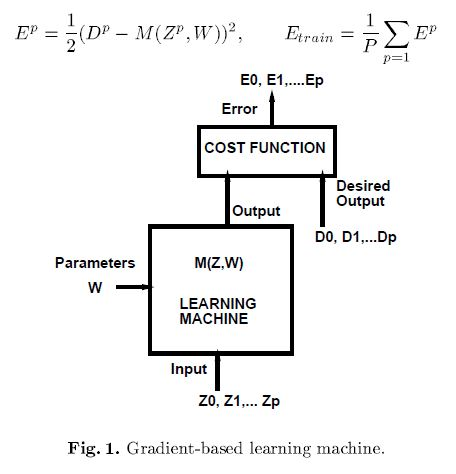
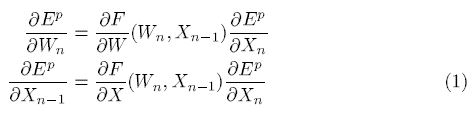
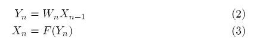
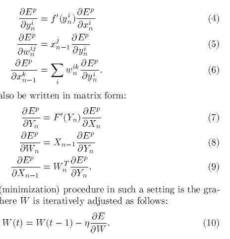
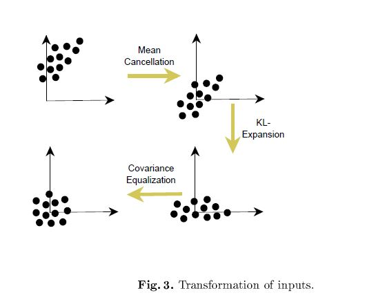
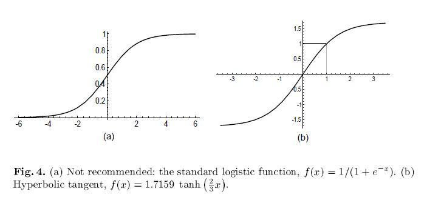

# Efficient BackProp

## Summary

- order
	1. intro
	2. 7 tricks
	3. 2 training methods
	4. further more
- other references
	-	[gradient, jacobian, hessian, laplacian](https://darkpgmr.tistory.com/132)

## Abstract

-	***연구자들의 back-prop convergence learning에 대한 분석***
-	***tricks*** to avoid undesirable behaviors of back-prop
-	classic : 2nd order optimization, not work in large NN
-	***few methods*** : no limit

## 1. Itroduction

-	back-prop : NN learning algorithm
	-	cuz : simple concept, efficient computation, often works
-	arbitrary choice : \# of nodes, layers, learning rates, train/test set

## 2. Learning and Generalization

- 

## 3. Standard Backpropagation

- 
- 
- 

## 4. A Few Practical Tricks

- back-prop disadvantage : slow
- why? cost surface is non-quadratic, non-convex, n-D => local min / flat region
- no formula to guarantee bellow
	1. NN converge to good sol
	2. convergence is swift
	3. convergence occurs at all

### 4.1 Stochastic VS Batch learning

- advantage of SGD
	1. fast
	2. better sol
	3. can track changes
- advantage of batch
	1. condition of convergence are well understood
	2. many acc tech (eg. conjugate gradient)
	3. theoretical analysis of the weight dynamics and convergence rates are simpler

### 4.2 Shuffling the Examples

- choose examples w/ max info content
	1. shuffle the training set => training examples never belong to same class
	2. input examples often create large error than small

### 4.3 Normalizing the Inputs

- transforming the inputs
	1. mean of each input variable in train-set => 0
	2. Scaling => same covar
	3. uncorrelated
- 

### 4.4 The Sigmoid

1. sigmoid/tanh (symmetric) : converge faster than logit
	- [Generalization and network design strategies, Y.LeCun]()
2. 
	- tanh : computationally expensive
3. stimes, add linear term : eg) $`f(x)=\tanh(x)+ax`$

### 4.5 Choosing Target Values

### 4.6 Initializing the weights

### 4.7 Choosing Learning rates

### 4.8 Radical Basis Functions vs Sigmoid Units

- radical foo : 무리함수

## 5. Convergence of Gradient Descent

### 5.1 A Little Theory

### 5.2 Examples

### 5.3 Input Transformations and Error Surface Transformations Revisited

## 6. Classical second order optimization methods

### 6.1 Newton Algorithm

### 6.2 Conjugate Gradient

### 6.3 Quasi-Newton (BFGS)

### 6.4 Gauss-Newton and Levenberg Marquardt

## 7. Tricks to compute the Hessian information in multilayer networks

### 7.1 Finite Difference

### 7.2 Square Jacobian approximation for the Gauss-Newton and Levenberg-Marquardt algorithms

### 7.3 Backpropagating second derivatives

### 7.4 Backpropagating the diagonal Hessian in neural nets

### 7.5 computing the product of the Hessian and a vector

## 8. Analysis of the Hessian in multi-layer networks

## 9. Applying Second Order Methods to Multilayer Networks

### 9.1 A stochastic diagonal Levenberg Marquardt method

### 9.2 Computing the principal Eigenvalue/vector of the Hessian

## 10. Discussion and conclusion

-	tricks
	1.	[shuffle the examples](#4.2-Shuffling-the-Examples)
	2.	[normalizing](#4.3-Normalizing-the-Inputs)
		- centering : the input variables by subtracting the mean
		- $`\sigma = 1`$ : normalize the input variable to a standard deviation of 1
		- decorrelate : (if possible)
	3.	[sigmoid](#4.4-The-Sigmoid) : w/ NN
		- 
	7.	$`-1\le target\le 1`$[link](#4.5-Choosing-Target-Values) : set target values within sigmoid range
	8.	[init W to rv](#4.6-Initializing-the-weights)

- training method
	1.	SGD w/ careful tuning | stochastic diagonal Levenberg Marquardt method : if classification & huge data (what's mean redundant?)
	2.	conjugate gradient : if small data | regression

- bad : classic 2nd order method

## Reference
